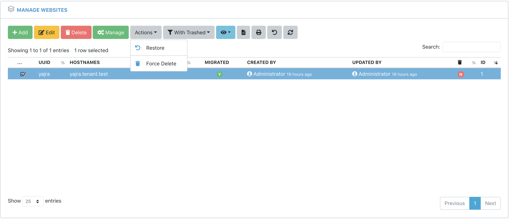

# WIP: Laravel DataTables Assets

A personal collection of DataTables server-side and client-side scripts.



> Note: The scripts relies on bootstrap 4 styles. Use at your own risk. :)

## Installation

`yarn add https://github.com/yajra/laravel-datatables-assets`


## Buttons Assets

```js
require('laravel-datatables-assets/js/dataTables.buttons');
```

### Laravel Integration

```php
use Yajra\DataTables\Html\Button;

Button::make('add'), // appends /create on current URL.
Button::make('create')->editor('editor'),
Button::make('edit')->editor('editor'),
Button::make('remove')->editor('editor'),
Button::make('restore'),
Button::make('duplicate'),
Button::make('duplicateSingle'),
Button::make('forceDelete'), // Force delete record(/s).
Button::make('forceDeleteSingle'), // Force delete a single record.
Button::make('export'),
Button::make('print'),
Button::make('reset'),
Button::make('reload'),
```

## Renderers Assets

```js
require('laravel-datatables-assets/js/dataTables.renderers');
```

### Laravel Integration

```php
use Yajra\DataTables\Html\Column;

Column::make('deleted_at')->render('$.fn.dataTable.render.boolean()'),
Column::make('deleted_at')->renderJs('boolean()'),

Column::make('post_count')->render('$.fn.dataTable.render.badge()'),
Column::make('deleted_at')->renderJs('badge()'),

Column::make('working_hours')->render('$.fn.dataTable.render.suffix("hrs")'),
Column::make('working_hours')->renderJs('suffix', "hrs"),

Column::make('code')->render('$.fn.dataTable.render.prefix("Code:")'),
Column::make('code')->renderJs('prefix', "Code:"),
```
